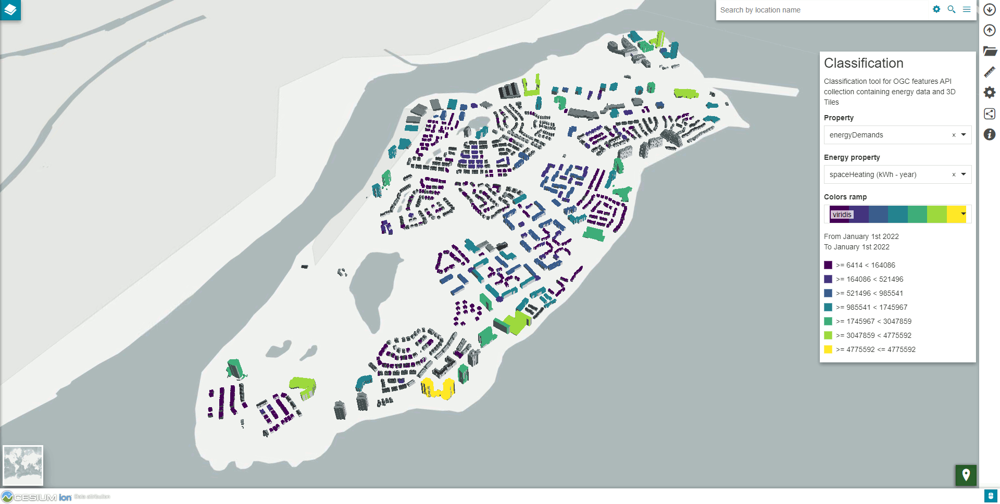
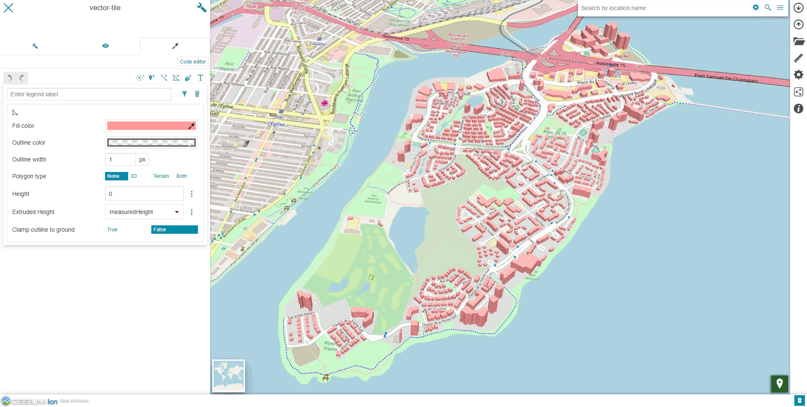

# Building Energy Data application

This custom application include following improvement and experimentation on MapStore:

- updated Cesium library to version 1.99.0 to test 3D Tiles version 1.1
- add the experimental `collection` query param to detect OGC features API endpoints that could contain 3D Tiles and GeoJSON (eg: https://geosolutions-it.github.io/mapstore-testbed/building-energy/dist/?collection=https://ogc-features-api/collections/buildings?f=json)
- add the experimental `mvt` query param to render Mapbox Vector Tiles layer (eg: https://geosolutions-it.github.io/mapstore-testbed/building-energy/dist/?mvt=https://ogc-features-api/collections/buildings/tiles/?f=tilejson)
- testing tiling client side of WFS and Vector (GeoJSON) layers
- test style extrusion options for fill symbolizer

Screenshot shows the client application using the `collection` param that enables the style classification plugin

Screenshot shows the client application using the `mvt` param that adds an experimental Mapbox Vector Tile layer

demo https://geosolutions-it.github.io/mapstore-testbed/building-energy/dist/#/

## Development

- `npm install`

- `npm start`

- app runs at http://localhost:8081/

npm install is needed only once at first setup or if the dependencies have been updated. If the installation does not solve correctly the dependencies use `npm install --legacy-peer-deps` (eg latest version of node/npm)

## Build the app

- `./build.sh`

the compiled app will be copied to `dist/` folder

## Tools

- node v14.17.0
- npm 6.14.13
