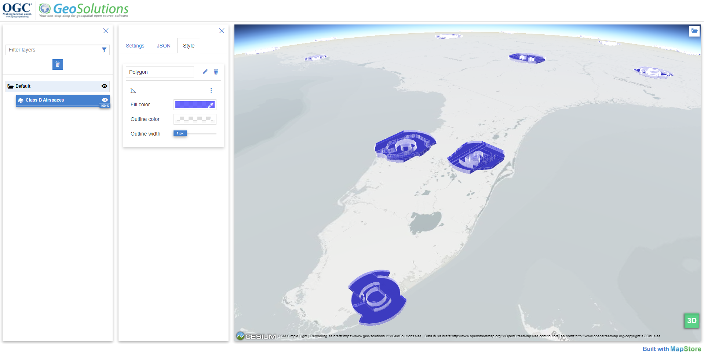

# Features and Geometries JSON application

Rendering of vector layers based on experimental GeoJSON formats. The application provides following components:

- catalog panel to connect to an OGC API endpoint (right panel)
- layer tree to select and edit imported layers (left panel)
- layer setting panel to edit params:
    - elevation property: if specified uses this property as elevation value
    - height property: if specified uses this property as height value
    - available crs: select a different crs to apply to the features collection
    - max features count: maximum number of feature to request
    - style: a dedicated panel to edit the features style (only polygon supported)
    - json preview: a preview in json of the selected collection
- map viewer: render the imported layers and it's possible to change between 2D (OpenLayers) and 3D (Cesium) view
- projection selector: available only for the 2D view allows to change the rendered projection
- time range selector: available only for GeoJSON with the experimental property `when` allows to visualize the time range of the imported collection and filter the features base on their own interval

demo https://geosolutions-it.github.io/mapstore-testbed/fgjson-app/dist/#/
## Development

- `npm install`

- `npm start`

- app runs at http://localhost:8081/

npm install is needed only once at first setup or if the dependencies have been updated. If the installation does not solve correctly the dependencies use `npm install --legacy-peer-deps` (eg latest version of node/npm)

## Build the app

- `./build.sh`

the compiled app will be copied to `dist/` folder

## Tools

- node v14.17.0
- npm 6.14.13
